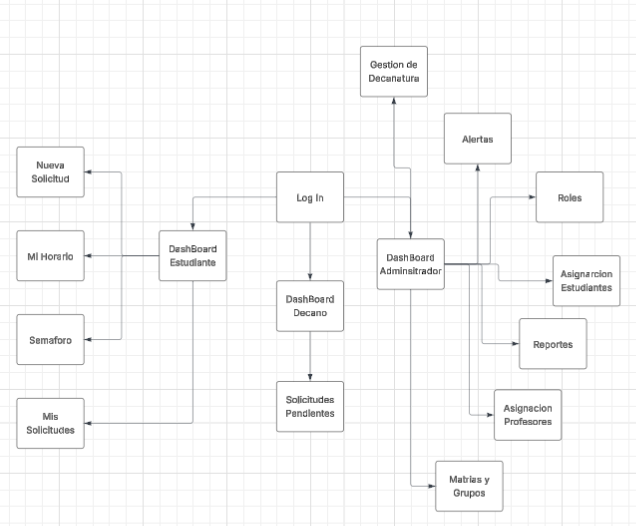

# Sirha-Frontend
Exodo - Sirha Frontend - Desarrollo y Operaciones de Software 2025-2

---

## Descripción
Este repositorio contiene el **Frontend del sistema SIRHA (Sistema de Reasignación de Horarios Académicos)** desarrollado en React.

## Tecnologías Utilizadas
- React + Vite
- Material UI (UI Components)
- React Router v6
- Vercel (despliegue)

## Estructura de Carpetas
## 📁 Estructura del Proyecto

#### Agrupación por Tipos de Archivos - Estructura clásica que organiza los archivos por su tipo/extensión más que por funcionalidad.
```bash
Sirha-Frontend/
├── .idea/                    # Configuración específica del IDE
├── build/                    # Archivos de construcción (output)
├── images/                   # Recursos multimedia
├── node_modules/             # Dependencias externas
├── src/                      # Código fuente principal
│   ├── components/           # Todos los componentes React
│   ├── styles/               # Todos los archivos de estilos
│   │   └── globals.css       # Estilos globales
│   ├── App.tsx               # Componente principal
│   ├── index.css             # Estilos del entry point
│   └── main.tsx              # Punto de entrada
├── .gitignore                # Archivos ignorados por Git
├── index.html                # Template HTML
├── package.json              # Configuración del proyecto
├── package-lock.json         # Lock de dependencias
├── README.md                 # Documentación
└── vite.config.ts            # Configuración de build
```
## Roles y Funcionalidades
- Estudiante
  - Visualización de horario actual 
  - Creación de solicitudes de cambio
  - Consulta de estado de solicitudes
  - Historial académico

- Decanatura
  - Revisión de solicitudes pendientes
  - Aprobación/Rechazo de solicitudes
  - Gestión de casos especiales
- Administrador
    - Gestión de usuarios y roles
    - Configuración académica
    - Reportes y estadísticas

# Principios UX y Heurísticas de Nielsen Aplicados en SIRHA

## **Principios de Diseño Centrado en el Usuario**

### 1. **Jerarquía Visual y Estructura Clara**
- **Aplicación**: La interfaz utiliza encabezados (`#`, `##`, `###`) para organizar la información de manera lógica
- **Beneficio**: Los usuarios pueden escanear rápidamente y encontrar lo que necesitan

### 2. **Consistencia y Estándares**
- **Aplicación**: Mantiene el mismo formato de tabla para horarios en todas las vistas
- **Beneficio**: Los usuarios aprenden una vez y navegan eficientemente

### 3. **Visibilidad del Estado del Sistema**
- **Aplicación**:
    - Muestra claramente el estado de las solicitudes (Pendiente/Aprobada/Rechazada)
    - Indica cupos disponibles en grupos (28/30, 17/25)
    - Muestra validaciones del sistema con checkboxes
- **Beneficio**: Los usuarios siempre saben qué está pasando

### 4. **Prevención de Errores**
- **Aplicación**:
    - El sistema valida automáticamente choques de horario
    - Verifica prerrequisitos antes de permitir cambios
    - Limita observaciones a 500 caracteres
- **Beneficio**: Reduce solicitudes inválidas y mejora la eficiencia

### 5. **Flujo de Trabajo Intuitivo**
```
Login → Dashboard → Ver Horario → Crear Solicitud → Confirmación
```

### 6. **Feedback Inmediato**
- Estados visuales de las solicitudes
- Confirmación de validaciones del sistema
- Información en tiempo real sobre cupos

### 7. **Accesibilidad**
- Contraste adecuado en texto
- Tamaño de fuente legible
- Navegación clara y predecible

## **Heurísticas de Nielsen Implementadas**

### 1. **Visibilidad del Estado del Sistema** 
- **Evidencia**:
    - Fechas de envío claramente visibles en solicitudes
    - Estados de solicitud organizados en pestañas
    - Barra de navegación muestra ubicación actual

### 2. **Correspondencia entre el Sistema y el Mundo Real**
- **Evidencia**:
    - Lenguaje familiar: "Grupo Actual", "Grupo Destino"
    - Términos académicos reconocibles: "Decanatura", "Créditos", "Modalidad"
    - Formato de horario intuitivo (días y horas)

### 3. **Control y Libertad del Usuario**
- **Evidencia**:
    - Botón "Cancelar" en formularios
    - Opción "Volver a Solicitudes" y "Volver al Dashboard"
    - Posibilidad de ver todas las solicitudes

### 4. **Consistencia y Estándares** 
- **Evidencia**:
    - Diseño uniforme en todas las pantallas
    - Mismo esquema de colores y tipografía
    - Patrones de interacción consistentes

### 5. **Prevención de Errores** 
- **Evidencia**:
    - Validaciones automáticas (choques de horario, cupos)
    - Selección por dropdown en lugar de entrada libre
    - Límites de caracteres en observaciones

### 6. **Reconocimiento antes que Recuerdo** 
- **Evidencia**:
    - Lista desplegable de materias registradas
    - Horario actual siempre visible como referencia
    - Información del estudiante pre-cargada

### 7. **Flexibilidad y Eficiencia de Uso** 
- **Evidencia**:
    - Accesos rápidos para diferentes tipos de usuario
    - Historial de solicitudes accesible
    - Filtros por estado de solicitud

### 8. **Diseño Estético y Minimalista** 
- **Evidencia**:
    - Interfaz limpia sin información irrelevante
    - Espaciado adecuado entre elementos
    - Jerarquía visual clara

### 9. **Ayuda a los Usuarios a Reconocer, Diagnosticar y Recuperarse de Errores** 
- **Evidencia**:
    - Validaciones claras con iconos (✓ y ☐)
    - Mensajes de estado comprensibles

### 10. **Ayuda y Documentación**
- **Evidencia**:
    - Instrucciones breves en formularios
    - Campos obligatorios marcados con *
    - Tooltips implícitos en etiquetas

---


## Levantamiento del Proyecto
http://localhost:5173/

## Diseño y Mockups
Los mockups de baja fidelidad fueron generados en Figma, siguiendo el Manual de Identidad (tipografía Work Sans y colores institucionales).
Incluyen las pantallas principales por rol (Estudiante, Decanatura, Administrador).

Link a los wireframes en Figma:
https://www.figma.com/make/ghLFGJcuLkyezWra8tEi2P/Wireframes-for-SIRHA-App?fullscreen=1

## Diagrama de Flujo entre Pantallas:



## Link de la Implementacion
https://sirha-exodo.netlify.app

## Ejecución Local
```bash
git clone https://github.com/TU-USUARIO/sirha-frontend.git
cd sirha-frontend
npm install
npm run dev
```